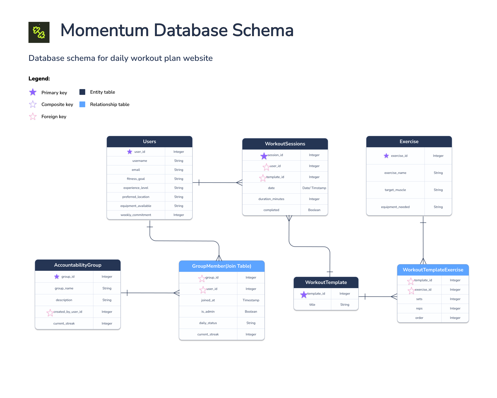

# Entity Relationship Diagram

Reference the Creating an Entity Relationship Diagram final project guide in the course portal for more information about how to complete this deliverable.

## Create the List of Tables

Our database consists of 4 main entity tables, 1 dynamic tracking table, and 2 junction tables. This structure supports automated workout plan generation based on onboarding preferences, history tracking, and group streaks:

*   **`users` (Entity):** Stores unique user profile information and fitness criteria collected from the 5-step onboarding questionnaire.
*   **`workout_sessions` (Dynamic History Entity):** Tracks executed workout routines, acting as the log to power weekly stats and the GitHub-style contribution grid.
*   **`workout_templates` (Entity):** Stores master metadata for our pre-built workout routines (e.g., "Beginner Upper Body").
*   **`workout_template_exercises` (Junction Table):** Maps exercises to workout templates with specific sets, reps, and sequencing order.
*   **`accountability_groups` (Entity):** Tracks the metadata for distinct, user-created physical accountability circles.
*   **`group_members` (Junction Table):** Bridges users and accountability groups, managing roles, daily statuses, and individual group streaks.
*   **`exercises` (Standalone Catalog):** A master reference library of individual physical movements.

---

## Add the Entity Relationship Diagram

### Table Structures

#### 1. users
| Column Name | Type | Description |
| :--- | :--- | :--- |
| `user_id` | integer | primary key |
| `username` | text | unique display name of the user |
| `email` | text | unique email address used for identification |
| `fitness_goal` | text | primary objective from onboarding (e.g., 'Build Muscle') |
| `experience_level` | text | training background from onboarding (e.g., 'Intermediate') |
| `preferred_location` | text | choice of training facility environment (e.g., 'At the Gym') |
| `equipment_available`| text | comma-separated list or array of user fitness gear |
| `weekly_commitment` | integer | number of days per week the user commits to train |

#### 2. workout_sessions
| Column Name | Type | Description |
| :--- | :--- | :--- |
| `session_id` | integer | primary key |
| `user_id` | integer | foreign key pointing to users.user_id |
| `template_id` | integer | foreign key pointing to workout_templates.template_id |
| `date` | date | the calendar date the training session took place |
| `duration_minutes` | integer | total length of the session in minutes (for weekly tracking stats) |
| `completed` | boolean | flag identifying if the session was successfully checked off |

#### 3. workout_templates
| Column Name | Type | Description |
| :--- | :--- | :--- |
| `template_id` | integer | primary key |
| `title` | text | name of the structured routine (e.g., 'Beginner Upper Body') |

#### 4. workout_template_exercises (Junction Table)
| Column Name | Type | Description |
| :--- | :--- | :--- |
| `template_id` | integer | foreign key pointing to workout_templates.template_id |
| `exercise_id` | integer | foreign key pointing to exercises.exercise_id |
| `sets` | integer | target number of sets to execute |
| `reps` | integer | target number of reps per set |
| `order` | integer | sequence index of the movement in the workout |

#### 5. accountability_groups
| Column Name | Type | Description |
| :--- | :--- | :--- |
| `group_id` | integer | primary key |
| `group_name` | text | unique title of the accountability group circle |
| `description` | text | short bio explaining the purpose or target of the group |
| `created_by_user_id`| integer | foreign key pointing to users.user_id (group owner) |
| `current_streak` | integer | cumulative daily consecutive tracking streak metric for the entire group |

#### 6. group_members (Many-to-Many Junction Table)
| Column Name | Type | Description |
| :--- | :--- | :--- |
| `group_id` | integer | foreign key pointing to accountability_groups.group_id |
| `user_id` | integer | foreign key pointing to users.user_id |
| `joined_at` | timestamp | timestamp when the user joined the accountability squad |
| `is_admin` | boolean | flag identifying if the user has administrative privileges |
| `daily_status` | text | explicit daily checking status identifier ('Done' or 'Pending') |
| `current_streak` | integer | individual workout consistency streak inside this group |

#### 7. exercises (Standalone Table)
| Column Name | Type | Description |
| :--- | :--- | :--- |
| `exercise_id` | integer | primary key |
| `exercise_name` | text | name of the physical exercise (e.g., 'Squat') |
| `target_muscle` | text | core anatomical muscle targeted by the movement |
| `equipment_needed` | text | primary mechanical equipment required to execute the lift |